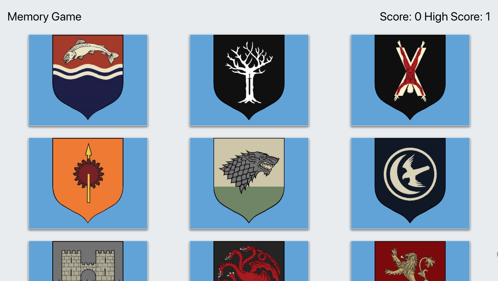

# React Memory Game - Game Of Thrones Edition

A simple but addictive memory game built using React.js and leveraging state to determine the game logic. Try to select all 12 of the Game Of Thrones house banners without clicking the same one twice. Try to beat your high score if your can't win! 

## Deployment

This app was deployed using heroku. There is no back end to this app. 
https://murmuring-peak-38606.herokuapp.com/

## Built With

* [Bootstrap](https://getbootstrap.com/docs/4.3/getting-started/introduction/)
* [React.js](https://reactjs.org/docs/getting-started.html)

## Authors

* **Alex Eversbusch** 

## Version

V1.0

## Screenshots
## Game Play

